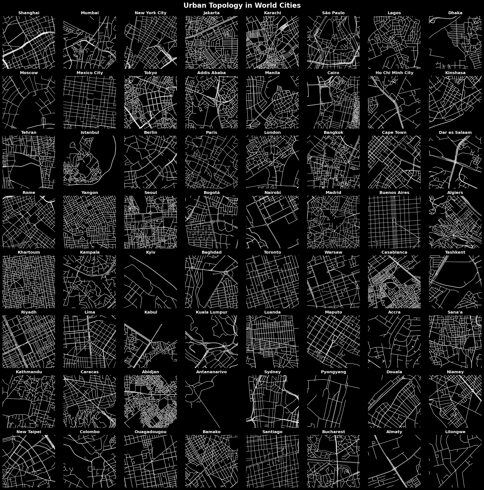

# morphometry
### a guide to current approaches to morphometrics

This repository catalogues techniques for measuring the built environment. There is variety of approaches and we will focus here on those that use open source tools. We begin with acquiring data, which typically leverages OpenStreetMap. 
- large extracts with [pyrosm](https://github.com/asrenninger/morphometry/blob/main/resources/pyrosm.ipynb)
- small extracts with [osmnx](https://github.com/asrenninger/morphometry/blob/main/resources/osmnx.ipynb)

Other datasets include [Google](https://sites.research.google/open-buildings/) and [Microsoft](https://www.microsoft.com/en-us/maps/building-footprints) buildings datasets, which contains the footprints for Africa and North America respectively.  

----

### coming soon
- [momepy](http://docs.momepy.org/en/stable/) 
- [OSMnx](https://osmnx.readthedocs.io/en/stable/index.html)
- [cityseer](https://github.com/benchmark-urbanism/cityseer-api) 
- [foot](https://wpgp.github.io/foot/) 

